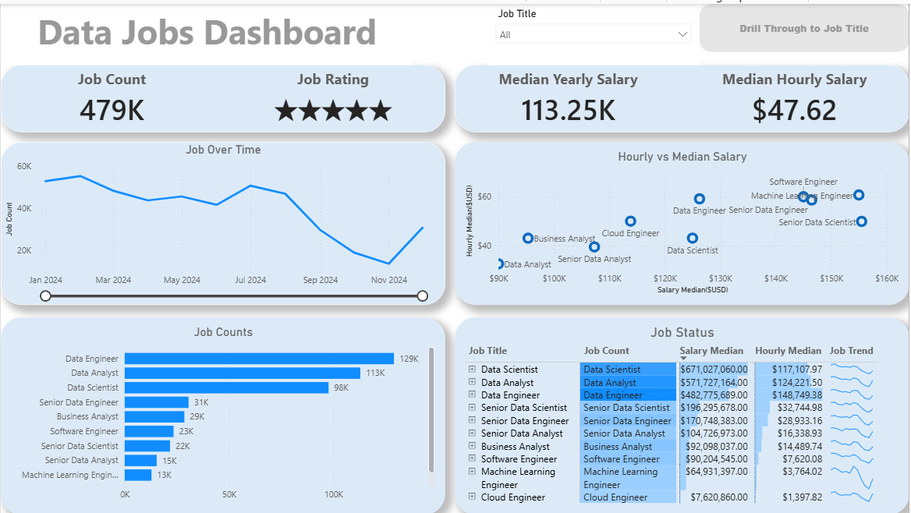

# 📊 Data Jobs Dashboard w/ Power BI

## 📝 Introduction

This dashboard was created for **Job Seekers, Job Transitioners, and Data Enthusiasts** to solve a common problem: information about the data job market is often scattered and difficult to analyze. Using a dataset of data-related job postings (including job titles, salaries, locations, and skills), this project provides an interactive interface to explore market trends and compensation distribution.

---

## 📁 Project Repository Files

* `Data_Jobs_Dashboard - 1st Project.pbix` - Main Power BI Desktop file.
* `job_postings_flat.zip` - Compressed raw dataset used for analysis.
* `Data Jobs Dashboard.png` - Preview image of the primary dashboard view.
* `Job Title Drill Through.png` - Preview image of the detail drill-through view.

---

## 🛠️ Skills & Features Showcased

This project covers key Power BI features and data visualization best practices:

- **⚙️ Data Transformation (ETL) with Power Query:** Cleaned, shaped, and prepared the raw data for analysis by handling missing values, adjusting data types, and structuring columns.
- **🧮 DAX & Measures:** Formulated custom measures and utilized **Quick Measures** (including custom **Star Rating** visual indicators, median salary calculations, and dynamic job counts).
- **📊 Core & Advanced Visuals:** Utilized **Column, Bar, Line,** and **Area Charts** to compare job counts and salary distribution trends over time.
- **🗺️ Geospatial Analysis:** Leveraged **Map Charts** to visualize the geographic distribution of data job opportunities.
- **🔢 KPI Cards & Detailed Tables:** Applied **Cards** for high-level metrics and structured **Tables** for granular, sortable data exploration.
- **🎨 Interactive Reporting:**
  - **Dynamic Slicers:** Filter report findings by job title, experience level, and work mode.
  - **Buttons & Bookmarks:** Integrated intuitive page navigation controls.
  - **Drill-Through Functionality:** Enables navigation from high-level market summaries to granular details for specific job roles.

---

## 📸 Dashboard Structure

The report is structured into two main pages:

### 1. High-Level Market Overview
  
Provides a high-level view of the data job market, featuring core KPIs such as job volume, median salaries, and top hiring job roles at a glance.

### 2. Job Title Drill-Through
  
A detailed view that allows deep-dive analysis for specific job titles, including salary ranges, remote work availability, and regional job distributions.

---

## 💡 Conclusion

This project demonstrates how Power BI can convert complex job posting data into actionable career insights. Users can dynamically slice, filter, and drill through the report to make data-driven career decisions.

---

👩‍💻 **Developed by:** Menna Mohamed Elnahass | Connect with me on [LinkedIn](https://www.linkedin.com/in/menna-mohamed-373629358?utm_source=share_via&utm_content=profile&utm_medium=member_android)
